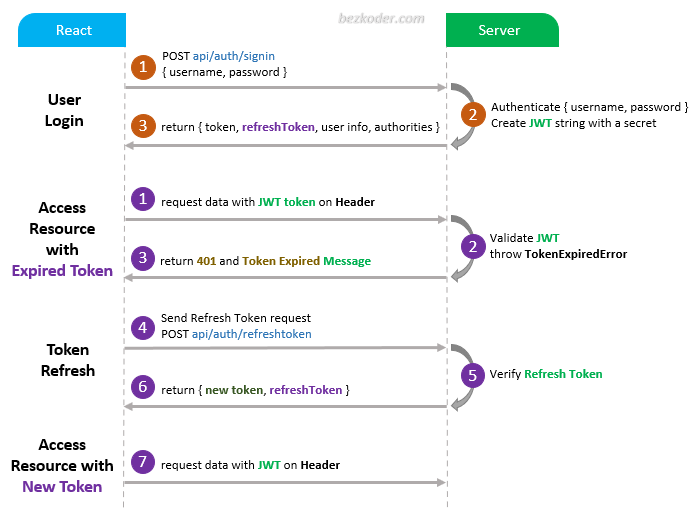

## Authentication System
Using access and refresh tokens

* saving access token in front-end's state (on memory)
* when refreshing the front-end, reenittiate the access token.




## A) Setup preparation
### 1- package installation
run `npm install`

### 2- ports the backend and database
* Backend port: 3000
* Database port: 5432

-----

## B) Database Setup

### 1- Create postgres User
```sh
CREATE USER postgres WITH PASSWORD 'postgres'
```


### 2- Create databases
```sh
CREATE DATABASE pstic;
CREATE DATABASE pstic_test;
```

### 3- Grant all database perviliges to postgres user
```sh
GRANT ALL PRIVILEGES ON DATABASE beneficiary_tracking TO postgres;
GRANT ALL PRIVILEGES ON DATABASE beneficiary_tracking_test TO postgres;
```

### 4- Run migration
db-migrate up


----

## C) Starting the server

* go to: 'http://localhost:3000/api/'
* then use the endpoints (Exists in the REQUIREMENTS.md file)