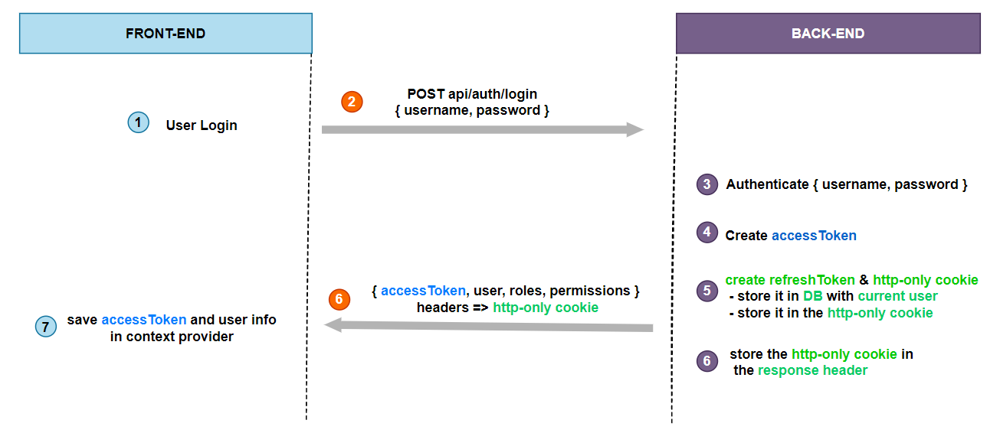

# Authentication System

## 1) Login


– A refreshToken will be provided at the time user signs in.
– A legal JWT must be added to HTTP Header if Client accesses protected resources.
– With the help of Axios Interceptors, React App can check if the accessToken (JWT) is expired (401), sends /refreshToken request to receive new accessToken and use it for new resource request.

---
## A) Setup preparation
### 1- package installation
run `npm install`

### 2- ports the backend and database
* Backend port: 3000
* Database port: 5432

-----

## B) Database Setup

### 1- Create postgres User
```sh
CREATE USER postgres WITH PASSWORD 'postgres'
```


### 2- Create databases
```sh
CREATE DATABASE beneficiary_tracking;
CREATE DATABASE beneficiary_tracking_test;
```

### 3- Grant all database perviliges to postgres user
```sh
GRANT ALL PRIVILEGES ON DATABASE beneficiary_tracking TO postgres;
GRANT ALL PRIVILEGES ON DATABASE beneficiary_tracking_test TO postgres;
```

### 4- Run migration
db-migrate up


----

## C) Starting the server

* go to: 'http://localhost:3000/api/'
* then use the endpoints (Exists in the REQUIREMENTS.md file)